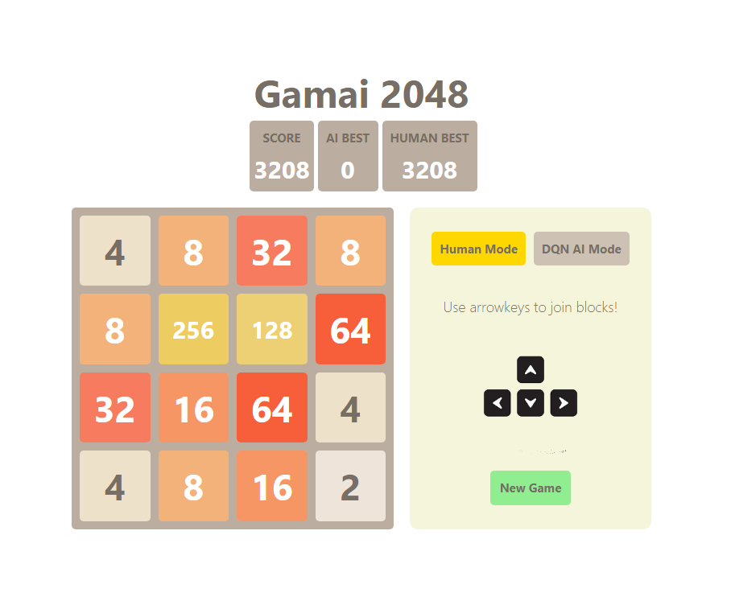
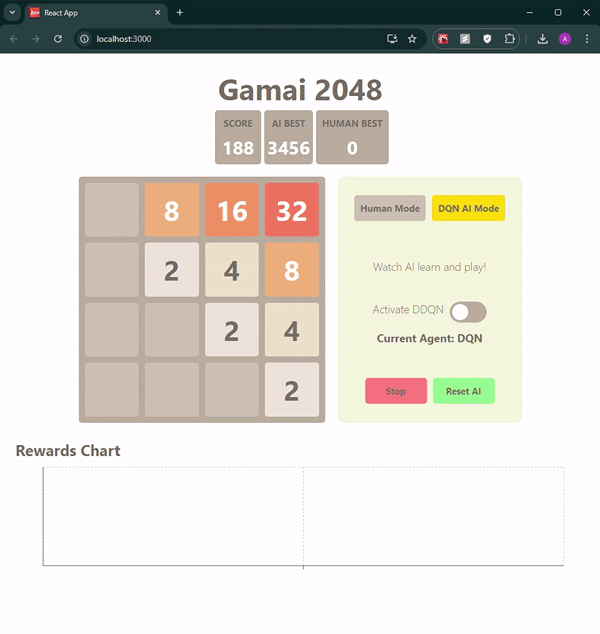

# Gamai 2048 Project

## Overview

This project is an implementation of the 2048 game, featuring both human and AI modes. The AI modes include Deep Q-Network (DQN) and Double Deep Q-Network (DDQN) algorithms for training and playing the game. Users can switch between human mode and AI modes to either play the game manually or let the AI learn and play the game.

## Features

- **Human Mode**: Play the 2048 game manually using keyboard inputs.
- **AI Mode**: Let the AI play the game using either DQN or DDQN algorithms.
- **Rewards Chart**: Visualize the AI's performance over time with a rewards chart.

## Demos

### Human Mode


### AI Mode (DQN/DDQN)


## Installation

To run the project, you need to install the required dependencies for both the server (backend) and client (frontend).

### Server (Backend)

Navigate to the `server` directory and install the required Python packages:

```bash
cd server
pip install -r requirements.txt
```

### Client (Frontend)

Navigate to the `client` directory and install the required Node.js packages:

```bash
cd client
npm install
```

## Running the Application

### Start the Backend Server

In the `server` directory, start the backend server:

```bash
python server/server.py
```

### Start the Frontend Application

In the `client` directory, start the frontend application:

```bash
npm start
```

## How to Play and Work with the Game

### Human Mode

In human mode, you can play the 2048 game manually using the arrow keys on your keyboard to join blocks and reach the 2048 tile.

### AI Modes

You can switch between DQN and DDQN modes to let the AI play the game:

- **DQN Mode**: Uses the Deep Q-Network algorithm to learn and play the game.
- **DDQN Mode**: Uses the Double Deep Q-Network algorithm to improve upon DQN by reducing overestimation bias.

## Types of Usage

### Human Mode

- Use arrow keys to play the game.
- Aim to reach the 2048 tile.

### DQN Mode

The Deep Q-Network (DQN) algorithm uses a neural network to approximate the Q-value function, which estimates the future rewards for each action in a given state. During training, the DQN interacts with the game environment and stores experiences (state, action, reward, next state) in a replay memory. The network samples mini-batches from this replay memory to update its weights, using the Bellman equation to minimize the difference between predicted and target Q-values. This process allows the DQN to learn optimal actions over time by adjusting its parameters to maximize cumulative rewards.

### DDQN Mode

Double Deep Q-Network (DDQN) improves upon the DQN by using two separate neural networks: one for selecting actions (the online network) and another for evaluating them (the target network). This separation helps to reduce overestimation bias in Q-value predictions, leading to more stable and reliable learning. The DDQN algorithm alternates between updating the online network with new experiences and periodically updating the target network to match the online network's weights. This approach refines the action-value estimates and enhances the overall performance of the AI agent.

## Understanding the AI

### DQN (Deep Q-Network)

The DQN algorithm leverages a neural network to approximate the Q-value function, which estimates the future rewards for each action in a given state. The key steps in the DQN process include:

- **Experience Replay**: Stores past experiences (state, action, reward, next state) in a replay memory. This allows the network to learn from a diverse set of experiences, breaking the temporal correlations and stabilizing learning.
- **Mini-Batch Learning**: Randomly samples mini-batches from the replay memory to update the network's weights. This process helps in reducing variance and improving convergence.
- **Q-Value Update**: Uses the Bellman equation to update the Q-values, minimizing the mean squared error between predicted and target Q-values.
- **Exploration vs. Exploitation**: Balances exploration (choosing random actions) and exploitation (choosing the best-known actions) using an epsilon-greedy strategy, where epsilon decays over time to shift from exploration to exploitation.

### DDQN (Double Deep Q-Network)

The DDQN algorithm builds on the DQN by addressing overestimation bias through the use of two neural networks:

- **Online Network**: Responsible for selecting actions based on the current policy.
- **Target Network**: Evaluates the selected actions to compute the target Q-values.
- **Reduced Overestimation**: By decoupling action selection and evaluation, DDQN provides more accurate Q-value estimates, leading to improved learning stability.
- **Periodic Updates**: Periodically updates the target network to match the online network, ensuring a consistent learning process.

## Tech Stack

- **Backend**: Flask, Python
- **AI**: TensorFlow Keras, OpenAI Gym
- **Frontend**: React, JavaScript, Tailwind CSS

## Project Progress and Updates

### Progress Overview

The project has seen significant advancements since its inception. We have meticulously integrated DQN and DDQN algorithms, refined the user interface, and enhanced the AI's learning capabilities. Our development journey is marked by rigorous testing, hyperparameter tuning, and continuous performance evaluation to ensure robust and efficient gameplay.

### Key Milestones

- **January 2023**: Initial implementation of the 2048 game with basic functionality.
- **March 2023**: Added DQN algorithm for AI gameplay. Conducted initial tests and observed promising results in learning efficiency.
- **June 2023**: Achieved the 2048 tile with DQN in 390 trials. This milestone validated our DQN implementation and highlighted areas for improvement.
- **September 2023**: Introduced DDQN algorithm to improve AI performance. The DDQN's reduced overestimation bias led to more stable learning and better overall performance.
- **December 2023**: Improved UI and added a rewards chart to visualize AI performance. This enhancement provided clearer insights into the AI's learning progress and achievements.

### Hyperparameter Tuning and Grid Testing

To optimize the performance of our AI agents, we conducted extensive grid testing on various hyperparameters. This process involved experimenting with different combinations of learning rates, discount factors, memory sizes, and exploration rates. By systematically evaluating these parameters, we identified optimal settings that balanced exploration and exploitation, leading to more efficient learning.

We used grid testing to validate different configurations and ensure the robustness of our models. The key hyperparameters for DQN included a memory size of 1500, a discount factor of 0.95, an exploration rate starting at 1.0 and decaying to 0.01, and a learning rate of 0.005. For DDQN, we adjusted the memory size to 2000, kept the same discount factor and exploration rate, and used a learning rate of 0.0001 with a tau of 0.1 for updating the target network.

## Future Work

- Further optimize the AI algorithms for better performance.
- Implement additional features and improve UI/UX.
- Explore other reinforcement learning techniques for playing 2048.